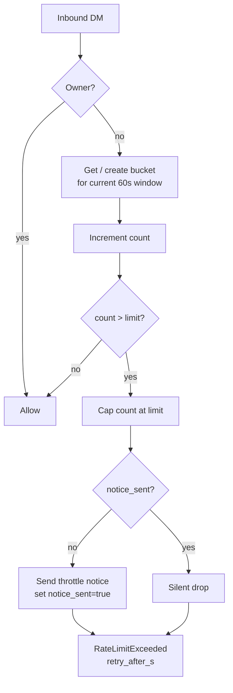

# Access Control

Two layers: chat-level gating via `access.json`, and per-user DM rate limiting.

**Files:** `pyclaudir/access.py`, `pyclaudir/rate_limiter.py`

## access.json

Hot-reloaded on every inbound message. No restart required to change policy.

```json
{
  "policy": "owner_only",
  "allowed_users": [],
  "allowed_chats": []
}
```

### Policies

| Policy | Who can DM | Which groups |
|--------|-----------|-------------|
| `owner_only` | Owner only | None |
| `allowlist` | Owner + `allowed_users` | `allowed_chats` only |
| `open` | Anyone | Any group the bot is added to |

Owner (`PYCLAUDIR_OWNER_ID`) is always allowed regardless of policy.

### Hot-Reload

`access.py` re-reads `access.json` on each `gate()` call. Editing the file on disk takes effect immediately. Errors in the file fall back to `owner_only` with a log warning.

### Owner Commands

The dispatcher's `/allow`, `/deny`, and `/policy` commands write `access.json` directly, so the operator can change policy from within Telegram.

## Rate Limiter (`rate_limiter.py`)

Per-user fixed-bucket rate limiting for DMs. Groups and owner are exempt.

### Bucket Model

```
window = 60s
limit  = PYCLAUDIR_RATE_LIMIT_PER_MIN (default 20)
```

One row per user in `rate_limits` table: `(user_id, bucket_start, count, notice_sent)`.

### Behavior



One throttle notice per user per 60-second bucket. Subsequent drops are silent.

Old buckets (>2 windows old) are cleaned up on each check.
