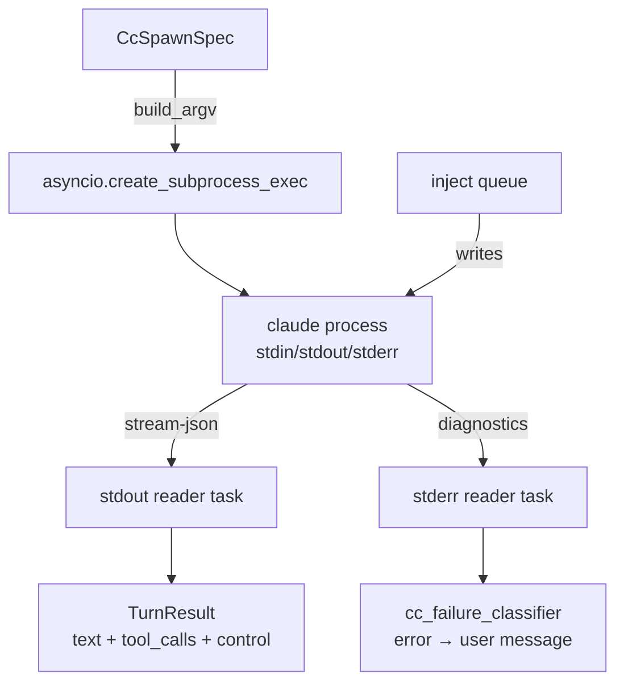
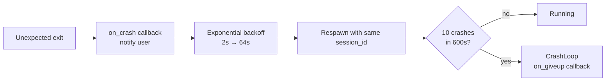

# CC Worker

Manages the `claude` subprocess lifecycle: spawn, I/O streaming, crash recovery, and session persistence.

**Files:** `pyclaudir/cc_worker/worker.py`, `pyclaudir/cc_worker/spec.py`, `pyclaudir/cc_worker/events.py`

## Subprocess Model



## CcSpawnSpec (`spec.py`)

Builds the `claude` argv. Key flags:

| Flag | Value |
|------|-------|
| `--model` | `PYCLAUDIR_MODEL` |
| `--output-format` | `stream-json` |
| `--mcp-config` | Generated JSON (local MCP + external MCPs from plugins.json) |
| `--system-prompt` | `prompts/system.md` + `prompts/project.md` |
| `--allowedTools` | Explicit allowlist (pyclaudir tools + opt-in groups) |
| `--effort` | `PYCLAUDIR_EFFORT` |
| `--session-id` | Persisted across restarts |

`--allowedTools` is the primary tool sandbox. Only tools explicitly listed can be called; everything else is blocked at the CC layer.

## Stream-JSON Protocol

CC writes one JSON object per line on stdout:

```
{"type": "text", "content": "Hello"}
{"type": "tool_use", "name": "send_message", "input": {...}}
{"type": "control", "action": "stop", "reason": "..."}
```

The stdout reader task dispatches each event to the appropriate handler.

## Crash Recovery



Backoff: `min(2 * 2^(attempt-1), 64)` seconds. Session ID is preserved so context survives crashes.

Config:

| Var | Default |
|-----|---------|
| `PYCLAUDIR_CRASH_BACKOFF_BASE` | `2.0` |
| `PYCLAUDIR_CRASH_BACKOFF_CAP` | `64.0` |
| `PYCLAUDIR_CRASH_LIMIT` | `10` |
| `PYCLAUDIR_CRASH_WINDOW_SECONDS` | `600.0` |

## Session Persistence

Session ID is written to `data/session_id` on clean shutdown. On next start, `CcSpawnSpec` reads it and passes `--session-id` so CC resumes the same conversation context. On crash, the same session ID is reused so partial context is retained.

## Events (`events.py`)

- `TurnResult`: Outcome of one turn — text output, tool call summary, control action, stderr.
- `CrashLoop`: Raised after crash limit exceeded. Triggers `on_giveup` callback and process exit.
