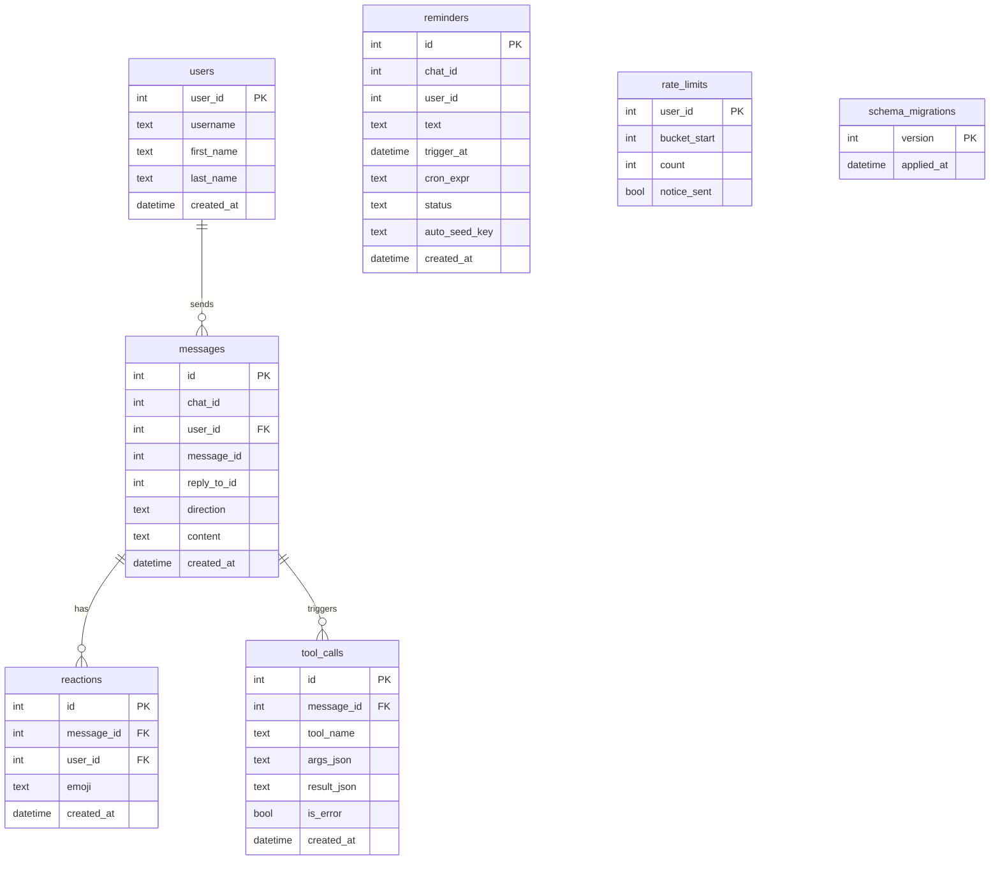

# Database

Async SQLite via `aiosqlite`. WAL mode. Foreign keys enabled. All state except files lives here.

**Files:** `pyclaudir/db/database.py`, `pyclaudir/db/messages.py`, `pyclaudir/db/reminders.py`, `pyclaudir/db/migrations/`

## Schema



## Migration Runner

Migrations live in `pyclaudir/db/migrations/NNN_name.sql`. On startup, the runner:

1. Creates `schema_migrations` if missing.
2. Reads all `.sql` files sorted by prefix number.
3. Applies any version not yet in `schema_migrations`.
4. Records each applied version.

Migrations are idempotent by version: applied once, never re-run.

## Migrations History

| Version | File | Adds |
|---------|------|------|
| 001 | `001_initial.sql` | messages, users, reactions, tool_calls, rate_limits |
| 002 | `002_reminders.sql` | reminders table |
| 003 | `003_cleanup.sql` | Performance indexes |
| 004 | `004_rate_limits_per_user.sql` | Per-user rate limit buckets |
| 005 | `005_reminder_auto_seed.sql` | `auto_seed_key` + `cron_expr` columns on reminders |

## Key Operations

**messages.py**
- `insert_message(chat_message)` → persists inbound and outbound messages
- `edit_message(message_id, new_text)` → updates content
- `delete_message(message_id)` → removes row
- `upsert_user(user)` → insert or ignore user record

**reminders.py**
- `create_reminder(chat_id, user_id, text, trigger_at, cron_expr, auto_seed_key)` → insert
- `list_pending(now)` → all reminders due and not sent
- `mark_sent(id)` → update status, compute next trigger for cron reminders
- `cancel(id)` → delete (tool layer blocks cancellation of auto_seed_key rows)

## Connection Settings

```python
PRAGMA journal_mode=WAL;
PRAGMA foreign_keys=ON;
```

WAL allows concurrent reads during writes, important for the reminder loop polling while the engine is active.
