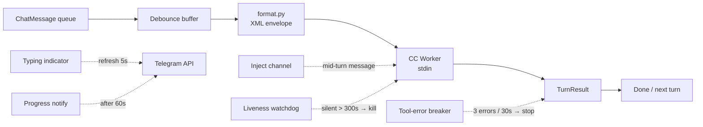

# Engine

The engine sits between the Telegram dispatcher and the CC worker. It buffers inbound messages, controls turn timing, and enforces liveness.

**Files:** `pyclaudir/engine/engine.py`, `pyclaudir/engine/format.py`

## Responsibilities



## Debounce Buffer

Messages arriving within `PYCLAUDIR_DEBOUNCE_MS` (default `0`) of each other are coalesced into one turn. If new messages arrive **while CC is processing**, they are queued for injection via the inject channel rather than starting a new turn.

## Mid-Turn Injection

The inject channel lets the engine feed additional user messages into an active CC turn without restarting it. CC receives an injected `<msg>` inside the ongoing conversation context.

Injection flow:
1. New message arrives while turn is in progress.
2. Engine appends to inject queue.
3. Worker writes to CC stdin at next opportunity.
4. CC processes as continuation.

## Typing Indicator

`bot.send_chat_action(TYPING)` is fired every 5 s while a turn is active. Telegram expires typing state after ~5 s, so continuous refresh is required. The indicator is stopped as soon as `send_message` delivers the first chunk (not after full turn completion).

## Tool-Error Breaker

If ≥ `PYCLAUDIR_TOOL_ERROR_MAX_COUNT` (default `3`) tool calls return errors within `PYCLAUDIR_TOOL_ERROR_WINDOW_SECONDS` (default `30`), the engine stops the current turn and sends a user-facing summary. Prevents infinite retry spirals.

## Progress Notify

If no user-visible output arrives within `PYCLAUDIR_PROGRESS_NOTIFY_SECONDS` (default `60`), engine sends "One moment…" to reassure the user. Fires once per turn.

## Liveness Watchdog

A background task polls `cc_worker.last_activity` every `PYCLAUDIR_LIVENESS_POLL_SECONDS` (default `30`). If the delta exceeds `PYCLAUDIR_LIVENESS_TIMEOUT_SECONDS` (default `300`), the CC process is killed and respawned. Distinguishes stuck (no heartbeat) from busy (heartbeat advancing inside long MCP call).

## XML Envelope (`format.py`)

All user messages are wrapped before being sent to CC:

```xml
<msg chat_id="..." user_id="..." flags="zero_width_stripped">
  Hello world
</msg>
```

Reminder turns use a `<reminder>` tag instead. Context-window metadata injected at turn start.

## Serialization

One turn at a time, per-engine. Multiple chats share the same engine and queue behind each other. This prevents context confusion but means a slow model serializes busy chats.
