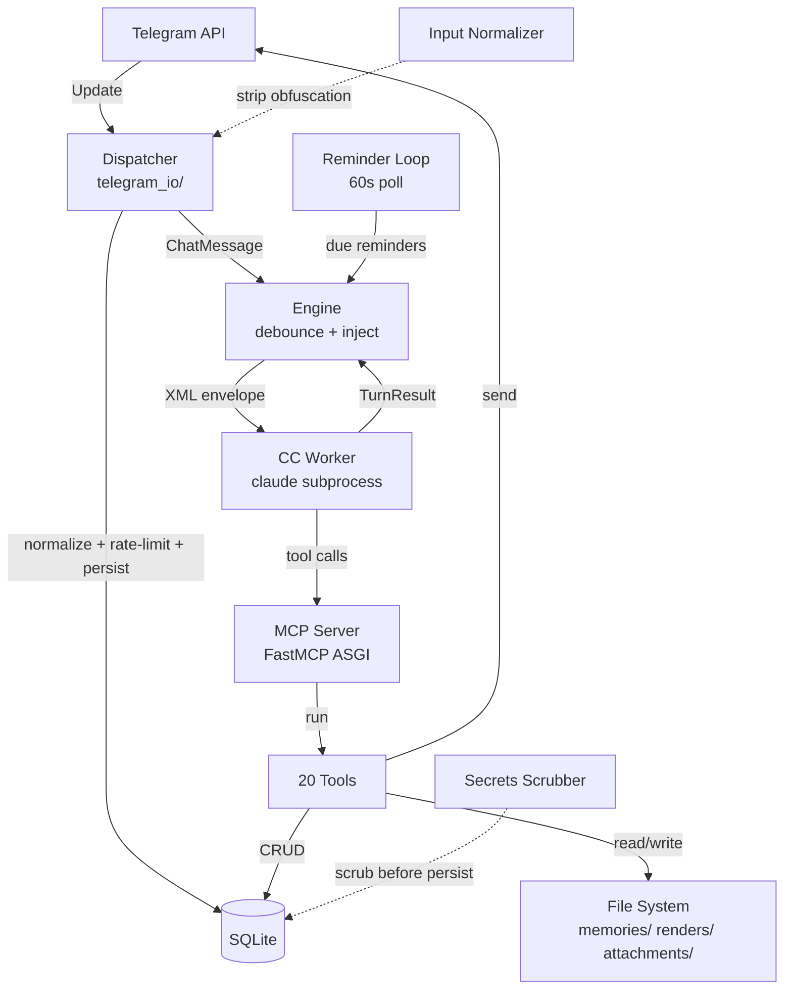
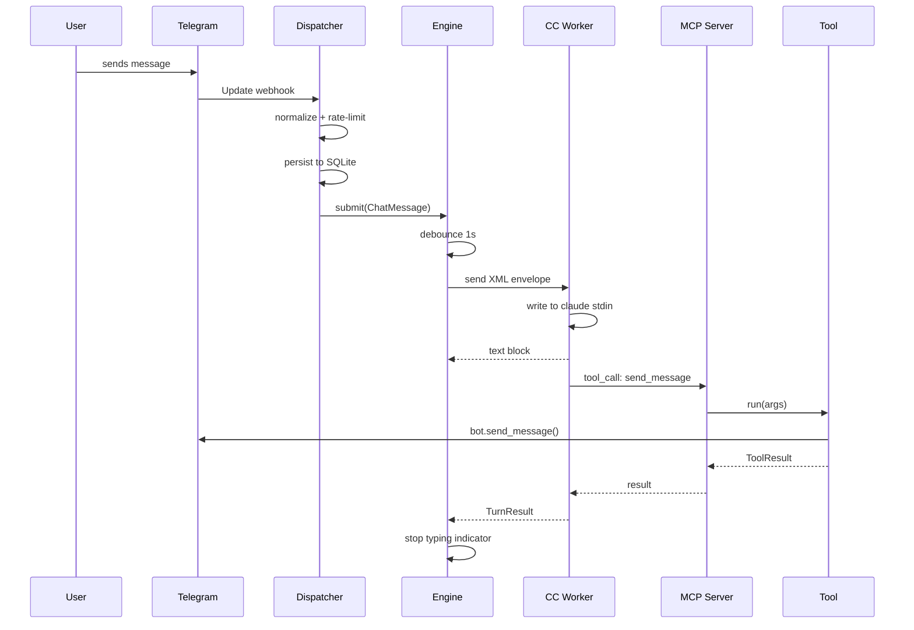

# pyclaudir System Mindmap

```mermaid
mindmap
  root((pyclaudir))
    Bootstrap
      __main__.py
        1 DB open + migrate
        2 MCP server on random port
        3 CC worker subprocess
        4 Engine + dispatcher
        5 Reminder loop
        6 Signal handlers
    Config
      config.py
        TELEGRAM_BOT_TOKEN
        PYCLAUDIR_OWNER_ID
        PYCLAUDIR_MODEL
        PYCLAUDIR_EFFORT
        Timeouts & Limits
        Derived data paths
    Telegram I/O
      telegram_io/dispatcher.py
        Inbound messages
        Edits & reactions
        Owner commands
          /kill /health /audit
          /access /allow /deny /policy
      telegram_io/attachments.py
        Download photos & docs
    Engine
      engine/engine.py
        Debounce buffer 1s
        Inject channel mid-turn
        Typing indicator 5s refresh
        Tool-error breaker 3/30s
        Progress notify after 60s
        Liveness watchdog 300s
      engine/format.py
        XML envelope assembly
        msg + reminder + context
    CC Worker
      cc_worker/worker.py
        Spawn claude subprocess
        Stdout reader stream-json
        Stdin writer
        Crash recovery exponential
        Session preservation
      cc_worker/spec.py
        CcSpawnSpec + build_argv
        allowedTools enforcement
      cc_worker/events.py
        TurnResult
        CrashLoop
    MCP Server
      mcp_server.py
        FastMCP ASGI
        Auto-discover BaseTool
        Pydantic → Signature wrap
        Heartbeat on every call
    Tools 20 built-ins
      Messaging
        send_message chunked 4096
        reply_to_message
        edit_message
        delete_message
        add_reaction
        create_poll + stop_poll
        send_photo
      Memory
        list_memories
        read_memory
        write_memory
        append_memory
        send_memory_document
      Data
        query_db read-only SELECT
        read_attachment photo PDF
      Scheduling
        set_reminder one-shot + cron
        list_reminders
        cancel_reminder
      Rendering
        render_html Chromium PNG
        render_latex KaTeX PNG
      Meta
        now UTC timestamp
        list_skills + read_skill
        read_instructions
        append_instructions owner-only
    Database
      db/database.py
        aiosqlite + WAL mode
        Migration runner
      Migrations
        001 messages users reactions
        002 reminders cron
        003 indexes
        004 per-user rate limits
        005 auto_seed_key cron_expr
      Tables
        messages
        users
        reactions
        tool_calls
        reminders
        rate_limits
        schema_migrations
    Storage
      storage/memory.py
        data/memories/ 64 KiB cap
        Path safety 3 layers
        Read-before-write guard
      storage/attachments.py
        data/attachments/ 20 MB cap
      storage/render.py
        data/renders/ PNG output
    Access Control
      access.py
        owner_only default
        allowlist policy
        open policy
        Hot-reload no restart
      rate_limiter.py
        20 DM/min per user
        Owner exempt
        DB-persisted buckets
    Security
      secrets_scrubber.py
        sk-* JWT AWS GitHub Slack
        DSN with passwords
        PEM private keys
      input_normalizer.py
        Zero-width chars stripped
        Bidi controls stripped
        NFKC normalization
      6 Invariants
        Subprocess isolation
        Tool allowlist
        Memory path safety
        Read-before-write
        Filesystem boundary
        No shell by default
    Skills
      skills_store.py
        Agent Skills Spec
        Frontmatter validation
        Disable via plugins.json
      Built-in skills
        self-reflection mandatory cron
        render-style house style
        trend-digest example
        reminder-format
    Plugins
      plugins.json
        tool_groups bash code subagents
        mcps stdio http sse
        skills_disabled
        builtin_tools_disabled
    Observability
      transcript.py
        RX TX DROP EDIT DEL audit
        pyclaudir.tx logger
      scripts/trace.py
        claude --resume session replay
      cc_failure_classifier.py
        Crash → user message mapping
    Models
      models.py
        ChatMessage
        ControlAction stop sleep heartbeat
```

## Architecture Overview

```mermaid
flowchart TD
    TG[Telegram API] -->|Update| DISP[Dispatcher\ntelegram_io/]
    DISP -->|normalize + rate-limit + persist| DB[(SQLite)]
    DISP -->|ChatMessage| ENG[Engine\ndebounce + inject]
    ENG -->|XML envelope| CCW[CC Worker\nclaude subprocess]
    CCW -->|tool calls| MCP[MCP Server\nFastMCP ASGI]
    MCP -->|run| TOOLS[20 Tools]
    TOOLS -->|send| TG
    TOOLS -->|read/write| FS[File System\nmemories/ renders/ attachments/]
    TOOLS -->|CRUD| DB
    CCW -->|TurnResult| ENG
    REMIND[Reminder Loop\n60s poll] -->|due reminders| ENG
    SECRETS[Secrets Scrubber] -.->|scrub before persist| DB
    NORM[Input Normalizer] -.->|strip obfuscation| DISP
```

## Process Lifecycle

```mermaid
sequenceDiagram
    participant U as User
    participant TG as Telegram
    participant D as Dispatcher
    participant E as Engine
    participant W as CC Worker
    participant M as MCP Server
    participant T as Tool

    U->>TG: sends message
    TG->>D: Update webhook
    D->>D: normalize + rate-limit
    D->>D: persist to SQLite
    D->>E: submit(ChatMessage)
    E->>E: debounce 1s
    E->>W: send XML envelope
    W->>W: write to claude stdin
    W-->>E: text block
    W->>M: tool_call: send_message
    M->>T: run(args)
    T->>TG: bot.send_message()
    T-->>M: ToolResult
    M-->>W: result
    W-->>E: TurnResult
    E->>E: stop typing indicator
```
