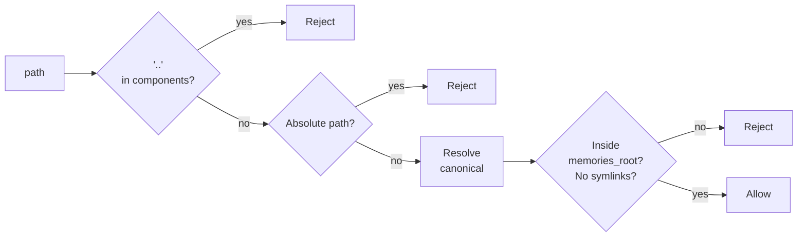

# Security

Six enforced invariants plus three runtime safeguards.

**Files:** `pyclaudir/secrets_scrubber.py`, `pyclaudir/input_normalizer.py`, `pyclaudir/storage/memory.py`, `pyclaudir/cc_worker/spec.py`

## Six Invariants

| # | Invariant | Where enforced |
|---|-----------|---------------|
| 1 | **Subprocess isolation** — only `CcWorker` calls `create_subprocess_exec` | Code review + architecture |
| 2 | **Tool allowlist** — CC spawned with `--allowedTools` | `cc_worker/spec.py` build_argv |
| 3 | **Memory path safety** — no `..`, no absolute paths, no symlinks, canonical check | `storage/memory.py` |
| 4 | **Read-before-write** — existing files require a prior `read_memory` call | `storage/memory.py` |
| 5 | **Filesystem boundary** — only `memory.py` tools touch disk | Tool architecture |
| 6 | **No shell by default** — bash / code / subagents off unless `plugins.json` enables them | `plugins.py` tool_groups |

## Secrets Scrubber (`secrets_scrubber.py`)

Applied before any user or tool content is persisted to SQLite.

**Patterns redacted to `[REDACTED]`:**

| Pattern | Matches |
|---------|---------|
| `Authorization: Bearer ...` | HTTP auth headers |
| `sk-[A-Za-z0-9]{20,}` | OpenAI / Anthropic API keys |
| `gh[pousr]_[A-Za-z0-9]+` | GitHub tokens |
| `AKIA[A-Z0-9]{16}` | AWS access key IDs |
| `xox[baprs]-[A-Za-z0-9-]+` | Slack tokens |
| `eyJ[A-Za-z0-9_-]+\.eyJ[A-Za-z0-9_-]+\.[A-Za-z0-9_-]+` | JWTs |
| `-----BEGIN.*PRIVATE KEY-----` | PEM private keys |
| `(postgres\|mysql\|mongodb)://[^:]+:[^@]+@` | DSNs with embedded passwords |

Names and email addresses are intentionally left untouched.

## Input Normalizer (`input_normalizer.py`)

Defangs hidden-character injection attacks before content is forwarded to CC.

**Stripped silently:**
- Zero-width chars: U+200B ZWSP, U+200C ZWNJ, U+200D ZWJ, U+2060 WJ, U+FEFF BOM, U+00AD soft hyphen
- Bidi controls: LRE, RLE, PDF, LRO, RLO, LRI, RLI, FSI, PDI

**Normalized:**
- NFKC normalization (collapses fullwidth, ligatures, homoglyphs)

**Flags returned** (included in XML `flags=` attribute so CC sees them):
- `zero_width_stripped`
- `bidi_stripped`
- `nfkc_changed`

CC can refuse a request flagged as obfuscated.

## Memory Path Safety (depth)

Three checks run in order; any failure rejects the path:

Normalization is **never** used to sanitize — paths are rejected, not cleaned.

## Tool Allowlist

`CcSpawnSpec.build_argv()` passes `--allowedTools` to the `claude` binary containing only:

- `mcp__pyclaudir__*` (all built-in tools)
- `WebFetch`, `WebSearch` (always-on Claude Code built-ins)
- Optional groups from `plugins.json`: `Bash`, `computer_use`, subagents, etc.

Any tool not on the list is blocked at the CC layer, independent of what the system prompt says.

## Mandatory Reminders Guard

Auto-seeded reminders (e.g. `self-reflection`) have an `auto_seed_key` set in the DB. The `cancel_reminder` tool checks this field and returns `is_error=True` if set. Prompt injection cannot override this — the guard is in Python, not in the prompt.
