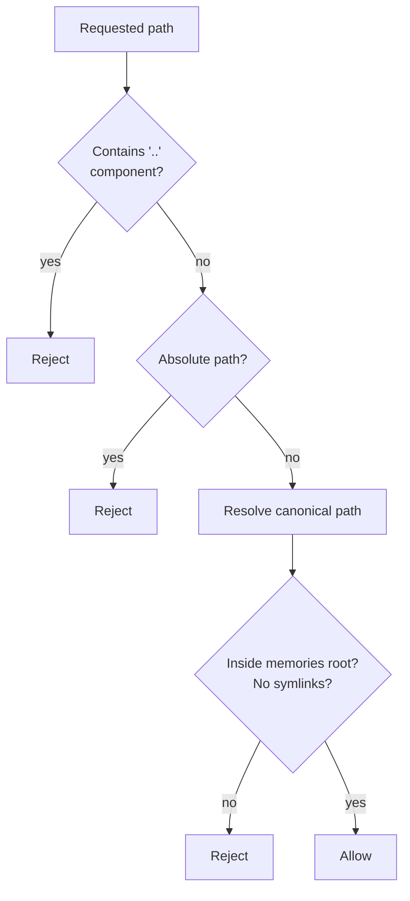

# Storage

Three file-backed stores under `data/`. Each enforces its own path safety and size limits.

**Files:** `pyclaudir/storage/memory.py`, `pyclaudir/storage/attachments.py`, `pyclaudir/storage/render.py`

## Memory Store (`storage/memory.py`)

Persistent markdown files the agent reads and writes. Root: `data/memories/`.

### Path Safety — 3 Layers



All three checks must pass. Normalization is never used as a substitute for rejection — `..` is rejected literally, not cleaned up.

### Read-Before-Write Guard

Before overwriting an existing memory file, the agent must have called `read_memory` for that path in the current process session. This prevents blind overwrites of operator-curated content. New files (not yet on disk) are exempt.

The guard resets on process restart, so it only covers the running session.

### Size Limit

64 KiB per file. Reads beyond the limit return truncated content with a `[truncated to 64 KiB]` marker. Writes that would exceed the limit are rejected.

### No Delete Tool

There is no `delete_memory` tool. The agent can overwrite to clear content, but deletion is operator-only (filesystem access required).

## Attachment Store (`storage/attachments.py`)

Inbound photos and documents downloaded from Telegram. Root: `data/attachments/`.

- Max file size: `PYCLAUDIR_ATTACHMENT_MAX_BYTES` (default 20 MB)
- Files named by Telegram `file_id`
- Used by `read_attachment` tool for vision (photos) and text extraction (documents/PDFs)

## Render Store (`storage/render.py`)

Output PNGs from `render_html` and `render_latex`. Root: `data/renders/`.

- Written by rendering tools after Chromium/KaTeX completion
- Consumed by `send_photo` tool to deliver image to Telegram
- Not cleaned up automatically (operator runs `scripts/prune-backups.sh` as needed)

## Data Layout

```
data/
  pyclaudir.db          ← SQLite database
  session_id            ← Persisted CC session ID
  memories/             ← Agent-readable/writable markdown files
  attachments/          ← Inbound media from Telegram
  renders/              ← Output PNGs from render tools
  prompt_backups/       ← Timestamped backups of project.md before each append
```
