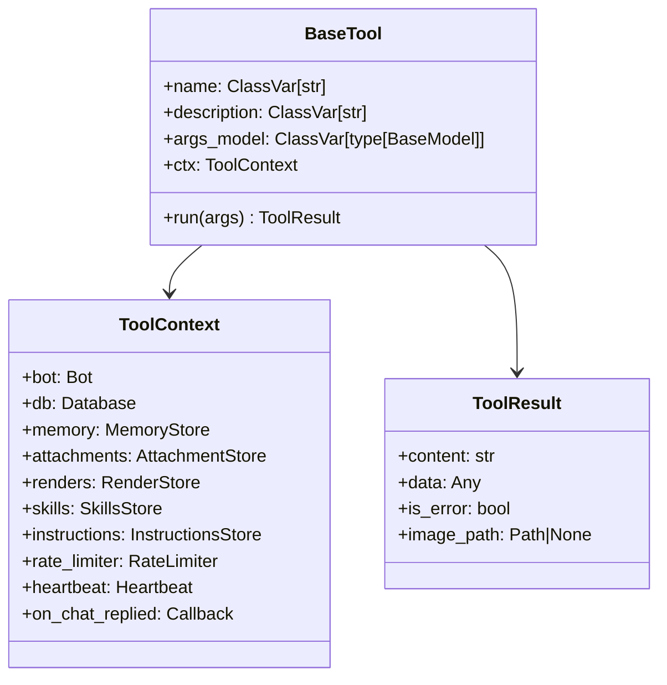

# Tools

20 built-in MCP tools auto-discovered by `mcp_server.py`. Each is a `BaseTool` subclass in `pyclaudir/tools/`.

**Files:** `pyclaudir/tools/`, `pyclaudir/mcp_server.py`

## Tool Framework



## MCP Server (`mcp_server.py`)

Discovery is zero-config: every concrete `BaseTool` subclass in `pyclaudir.tools` is automatically registered.


On every call: bump heartbeat → audit log → run tool → timing log.

## Tool Catalogue

### Messaging

| Tool | Description |
|------|-------------|
| `send_message` | Primary output. Auto-chunks at paragraphs, 4096-char limit. Markdown → Telegram HTML. |
| `reply_to_message` | Quote-reply a specific message by ID. |
| `edit_message` | Edit a previously sent bot message. |
| `delete_message` | Delete a previously sent bot message. |
| `add_reaction` | Add emoji reaction to any message. |
| `create_poll` | Regular or quiz poll. Supports multi-answer, auto-close timer. |
| `stop_poll` | Close an active poll early. |
| `send_photo` | Deliver a render PNG as inline photo. |
| `read_attachment` | Read inbound photo (vision) or document (text/PDF extraction). |

### Memory

| Tool | Description |
|------|-------------|
| `list_memories` | List all files under `data/memories/`. |
| `read_memory` | Read a memory file (≤64 KiB). |
| `write_memory` | Overwrite a memory file. Requires prior `read_memory` if file exists. |
| `append_memory` | Append text to a memory file. |
| `send_memory_document` | Deliver a memory file as a downloadable document to the user. |

### Data

| Tool | Description |
|------|-------------|
| `query_db` | Read-only `SELECT` on messages / users / reminders tables. Max 100 rows. |

### Scheduling

| Tool | Description |
|------|-------------|
| `set_reminder` | One-shot or cron-recurring reminder. `trigger_at` is UTC ISO-8601. |
| `list_reminders` | List pending reminders for current chat. |
| `cancel_reminder` | Cancel by ID. Auto-seeded reminders (e.g. self-reflection) refuse cancellation. |

### Rendering

| Tool | Description |
|------|-------------|
| `render_html` | Render HTML to PNG via headless Chromium (network-blocked). |
| `render_latex` | Render LaTeX to PNG via KaTeX. |

### Meta

| Tool | Description |
|------|-------------|
| `now` | Return current UTC timestamp. |
| `list_skills` | List available skills (name + description from frontmatter). |
| `read_skill` | Return full SKILL.md body for a named skill. |
| `read_instructions` | Read `prompts/project.md`. |
| `append_instructions` | Append to `prompts/project.md`. Owner-only. |

## send_message Chunking

Long text is split without cutting mid-word:

```
paragraph boundaries (\n\n)
  → line boundaries (\n)
    → word boundaries (space)
      → hard cut at 4096
```

Each chunk is converted to Telegram HTML independently and sent as a separate message.

## Adding a New Tool

1. Create `pyclaudir/tools/my_tool.py`.
2. Subclass `BaseTool`, set `name`, `description`, `args_model`.
3. Implement `async def run(self, args) -> ToolResult`.
4. No registration step — `mcp_server.py` discovers it automatically on next start.
